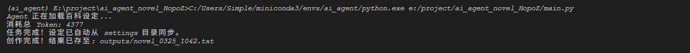

一个AI agent工作

# 特点
- 无需网页端次次输入，只需在根目录放入设定文档，AI agent就会根据设定文档进行工作。
- 自动生成prompt，自动调用API，自动总结经验，自动调整策略。


# 准备
requirements：
```
pip install langchain
pip install langchain-openai
pip install python-dotenv
```
# 根目录创建.env文件，填入`DEEPSEEK_API_KEY=<your_api_key>`

# DEEPSEEK_API_KEY购买网址
[https://platform.deepseek.com/top_up](https://platform.deepseek.com/top_up)

# 根目录创建settings目录放入各种设定的markdown文档,比如
```
人物设定.md
等级设定.md
...
```

接着运行[main.py](./main.py)

# 结果如图所示


# TODO
-长期复杂文章记忆
-UI框架