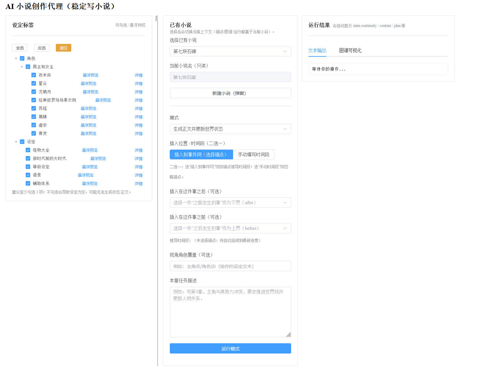
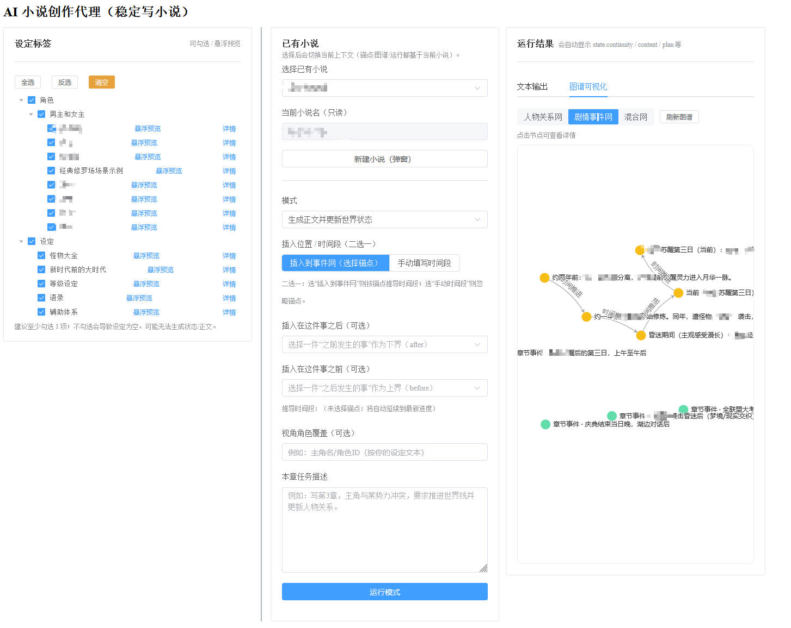

# AI Novel Agent

面向长篇网文 / 系列叙事的工程化写作系统：以 `lores/` 下 Markdown 为设定来源，用 **plan → write → state 更新 → 持久化** 形成可迭代的创作闭环；提供 **FastAPI + Vue 3** 的 Web 工作台（Input 预览、SSE 流式输出、知识图谱编辑），以及可选的终端 CLI 与 Flet 移动端示例。

**预览**

| Web 工作台 | 知识图谱 |
|-----------|---------|
|  |  |

---

## 技术栈

| 层级 | 技术 |
|------|------|
| 前端 | Vue 3、TypeScript、Vite、Element Plus、ECharts；可选 Electron 桌面壳 |
| 后端 | Python 3、FastAPI、LangChain（DeepSeek API） |
| 领域 | `NovelAgent`、状态压缩与合并、图谱四表持久化、Lore 摘要缓存 |

---

## 快速开始

### 1. 安装依赖

```bash
pip install -r requirements.txt
```

### 2. 配置 API 密钥

在仓库根目录创建 `.env`：

```bash
DEEPSEEK_API_KEY=<your_api_key>
```

### 3. 准备设定

将 Markdown 设定放入 `lores/`（相对路径即标签空间，供勾选与注入）。


### 开始（三选一）
####  启动 Web

在**仓库根目录**执行：

```bash
python -m uvicorn webapp.backend.server:app --reload --port 8000
```

浏览器访问：`http://127.0.0.1:8000/`

- 启动时会尝试构建前端（`webapp/frontend` → `dist/`）。若已自行构建或想跳过：设置环境变量 `SKIP_FRONTEND_BUILD=1`。
- 单独开发前端：`cd webapp/frontend && npm install && npm run dev`（代理与端口以 `vite.config.ts` 为准）。

####  终端 CLI

不经过 Web 状态机，仅多轮对话 + Lore 原文注入：

```bash
python -m cli
```

默认使用 DeepSeek **深度思考**模型（`deepseek-reasoner`），终端流式区分「深度思考」与「正文」，会话文件与多轮历史仅保留正文以便 API 兼容。加 `--fast` 可改用 `deepseek-chat`。

####  Electron 桌面壳

下载release下的exe

---

## 功能要点

- **先预览再运行**：主流程先请求 `preview_input`，确认后再 `run_stream`，减少误触耗 token。
- **流式与可中止**：规划 / 正文 / 优化建议等 SSE 阶段可观察；可中止以节省 token。
- **下章续写**：写章、修订、扩写或优化完成后可弹出「下章提示」，确认后沿用「生成正文」同款预览链，并尽量自动绑定本章时间线事件。
- **图谱**：人物 / 事件 / 混合视图，全屏编辑节点与边（数据落在 `storage/novels/<id>/novel.db` 中四表与 `novel_state`）。
- **前端适配**：窄屏（约 ≤1180px）三栏纵向堆叠；宽屏下随窗口压缩左/中栏宽度，减少横向滚动；中间表单区折叠为手风琴（一次只展开一块）。

---

## 运行模式（`RunModeRequest.mode`）

| 模式 | 说明 |
|------|------|
| `init_state` | 初始化世界（写作前需已初始化） |
| `plan_only` | 仅章节规划并更新状态 |
| `write_chapter` | 规划 + 正文 + 落盘 |
| `revise_chapter` | 修订（沿用规划 + 写作链路） |
| `expand_chapter` | 扩写（写作阶段为 expand） |
| `optimize_suggestions` | 优化建议（独立链路，非整章落盘主链） |

---

## 仓库结构（简）

```text
agents/              # 领域：NovelAgent、状态、提示词、持久化、Lore
webapp/backend/      # FastAPI：路由、SSE、schemas、run_helpers、graph_payload
webapp/frontend/     # Vue 3 工作台源码
lores/               # 设定 Markdown（可按 .gitignore 决定是否入库）
storage/             # 运行数据、摘要缓存、按小说分目录
outputs/             # 正文归档
cli.py               # 终端入口
electron/            # Electron 壳（子进程 uvicorn + 窗口）
mobile/              # Flet 客户端示例
```

---

## 数据与接口（摘要）

持久化要点：

- **单本小说数据**：`storage/novels/<id>/novel.db`（SQLite：`novel_state`、章节行、图谱四表）
- **运行态叙事状态**：`novel_state` 表中的 `NovelState` JSON（人物关系边以四表为准）
- **图谱**：人物/事件实体与关系存于上述 DB，与 API `GET/PATCH/POST/DELETE /api/novels/{id}/graph*` 对应

常用 HTTP 示例：

- `POST /api/lore/summary/build`、`GET /api/lore/tags`、`GET /api/lore/preview`
- `POST /api/novels/{id}/preview_input`、`POST /api/novels/{id}/run_stream`（SSE）
- `POST /api/novels/{id}/run`（非流式 JSON）

完整字段与行为以代码为准：`webapp/backend/schemas.py`、`agents/`、`storage/` 下说明（若仓库中包含对应文档）。

---

## 设计取向（简）

- **连续性**：状态机驱动，而非单次生成即弃。
- **设定可控**：标签化 Lore，摘要缓存 + 未命中回退原文。
- **可观测**：阶段事件、token 提示、Input 可预览。
- **稳健**：结构化输出与合并策略，降低长输出失败成本。

实践建议：先为常用 tag 生成摘要再写章；按章收敛任务；人物与事件关系以图谱表为事实源，再进入生成。

---

## 路线图

功能进度与计划见 [TOURMAP.md](./TOURMAP.md)。

---

## 许可证与作者

- **许可证**：AGPL-3.0-or-later，见 [LICENSE](./LICENSE)。
- **作者**：见 [NOTICE](./NOTICE)。
